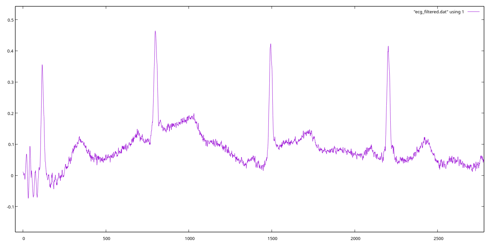

# 50Hz filter

Demo which filters about 50Hz from a noisy ECG.
This is a minimal example where the reference noise is just
a 50Hz sine wave and the DNF removes the 50Hz from the
ECG by using this 50Hz sine. This, of course, can also be
done by a simple LMS FIR filter but this here serves as an example
code which can then be used for more complex reference signals.

## How to run

```
./ecg_filt_demo
```

## How to plot the results?

```
python plot_results.py
```

which plots the contents of `ecg_filtered.dat` which has
three columns: DNF output, input, noise reference. By default
the script plots the output of the filter but you can specify
as an argument the column.


