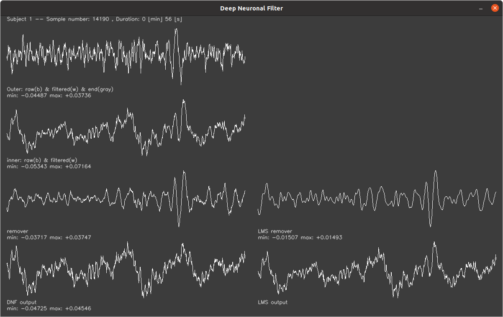

# Deep Neurnal EEG Filter

Removes adaptively EMG muscle noise from EEG



## Dataset

Download the dataset from https://researchdata.gla.ac.uk/1258/
and unpack the zip outwidth of this repository so that the directory
structure looks like this:
```
--+--deepNeuronalFilter/eeg_filter
  |
  +--gla_researchdata_1258
```


## How to build

Go to the parent directory and run `cmake .` and `make` from there initially. Then you can
also do `make` in this subdirectory later.

## How to run

### Single subject and task
```
./eeg_filter <subject number> [task]
```
where the subject number is compulsory and the task
(p300, jawclench, ...) is optional. Default is p300.

### All subjects and both p300 & jawclench

Just type:
```
./runall.sh
```
and the data from all 20 subjects is filtered for both
the p300 and the jawclench task.

## Analysis

For plotting the P300 peaks, calculating the SNR, the weight
developments go to the subdirectory `analysis`.
