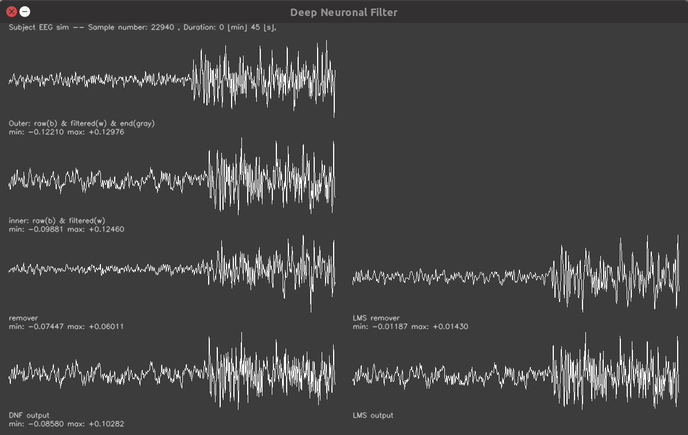

# Deep Neurnal EEG Filter -- with simulated EEG

Removes adaptively EMG muscle noise from EEG



## How to build

Go to the parent directory and run `cmake .` and `make` from there initially. Then you can
also do `make` in this subdirectory later.

## How to run

### Single simulation
```
./eeg_sim [-a]
```
where `-a` disables the graphical output. The output directory
is `results`.

### Stats simulation
```
./eeg_sim [-b]
```
which runs multi-threaded with 20 runs and stores the
results in `results/0..19/`.

## Analysis

Head to the `analysis` directory.
