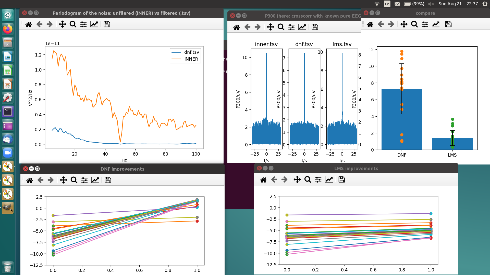

# Data analysis tools

## Pre-requisites

The following python modules are required:
 - matplotlib
 - numpy
 - plotly
 - scipy

To plot the weights please install `gnuplot`.

## Commandline parameters

All python commandline tools have the same parameters:
 - -p experiment number between 0 and 19 (default uses the `results` parent dir)
 - -s The second at which the data analysis starts (default 60sec simulated jawclench)
 - -f The filter output file used. That can be either "dnf.tsv" (default) or "lms.tsv"
 - -h Help

All parameters are optional and have default values set.

## explore.py

Displays a timedomain and frequency domain plot either in
matplotlib or in the browser.
```
./explore.py -p experiment -s startsec -e endsec -f noiseredfile.tsv -t task -m -h
```
 - Option -m switches over to matplotlib. Default is plotly.
 - Option -e is the second where the plot ends in the timedomain.

## pure_eeg_signal_ampl_with_cc.py 
Plots the amlitude of the pure EEG signal component by cross
correlating the pure EEG signal with the output of the DNF.
Note that the cross correlation replaces the P300 from the real EEG experiment 
because here we know the pure EEG which we generated artificially.
The cross correlation serves here exactly the same purpose as the P300
as it's essentially "event related" on a sample by sample basis.
```
./pure_eeg_signal_ampl_with_cc.py -p experiment -s startsec -f file -h
```

## snr.py



Calculates the SNR of one experiment
```
./p300.py -p experiment -s startsec -f file -h
```

## SNRcompareDNFLMS.py
Compares DNF SNR increase against LMS SNR increase for simulated jawclench.
```
./SNRcompareDNFLMS.py
```

## plot_weights_subject10_jawclench.plt
Gnuplot script which plots the weights of the individual layers for the non-stats version.
```
gnuplot plot_weights.plt
```
which generates `plot_weights.eps`.
