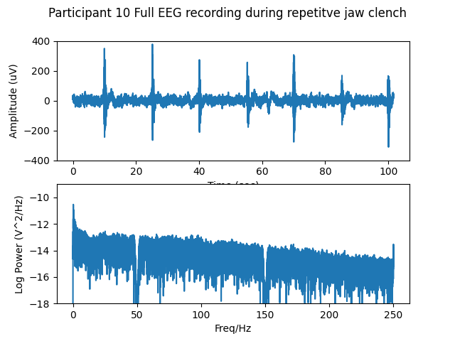

# Power spectra during jaw clench task

The aim is to assess the power spectrum of facial EMG.
The subject was asked to clench their jaw for approximately
one second every 15secs.

## Full recording

Run `python ./plot_subj10_t_f.py`:

## Spectrum of the jaw clenches (EMG)

All jaw clenches concatenated. Run: `python3 ./plot_subj10_t_f.py jawclench`:

## Spectrum at rest

Run `python3 ./plot_subj10_t_f.py rest`:

