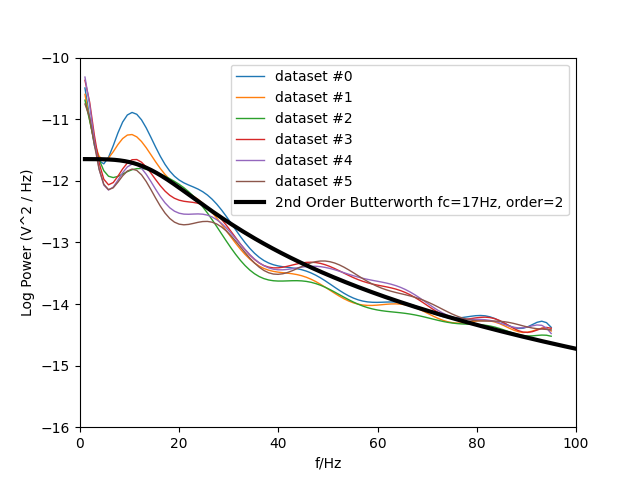

# Modelling pure EEG power with a 2nd order lowpass



Log Power spectra of pure EEG from two temporarily paralysed
subjects. Data adapted from the figures in:

Scalp electrical recording during paralysis: Quantitative evidence that
EEG frequencies above 20 Hz are contaminated by EMG
Emma M. Whitham a , Kenneth J. Pope b , Sean P. Fitzgibbon c , Trent Lewis b ,
C. Richard Clark c , Stephen Loveless d , Marita Broberg e , Angus Wallace e ,
Dylan DeLosAngeles e , Peter Lillie f , Andrew Hardy f , Rik

by having manually clicked on the datapoints of the 6 PSD plots
in the paper and then done a polynomial fit to smooth out the errors
from the manual reconstruction.

The script `paralysed_EEG_PSD_vs_lowpsss.py` shows a fit to a 2nd
order lowpass with:

```
filter order = 2
cutoff = 17 Hz
EEG signal amplitude = 1.5e-6 Volt
``

Where the EEG amplitude is for the pre-filtered amplitude.
